# PRAKTIKUM 1 HTML DASAR
## Langkah-Langkah Praktikum

Persiapan membuka VSCode dengan Browser.
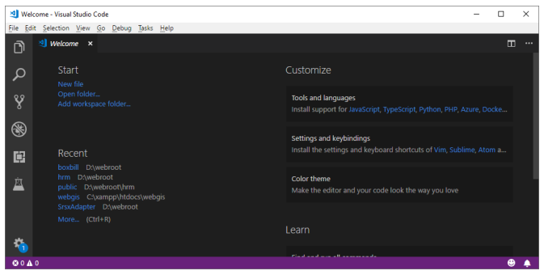 


Kemudian buat file baru dengan nama lab1_tag_dasar.html dan tambahkan tag dasar dokumen HTML.
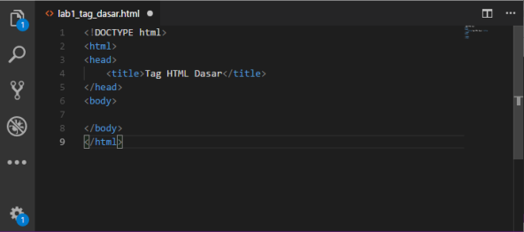 


Kemudian selanjutnya, buka file tersebut pada web browser misalnya Mozilla Firefox.
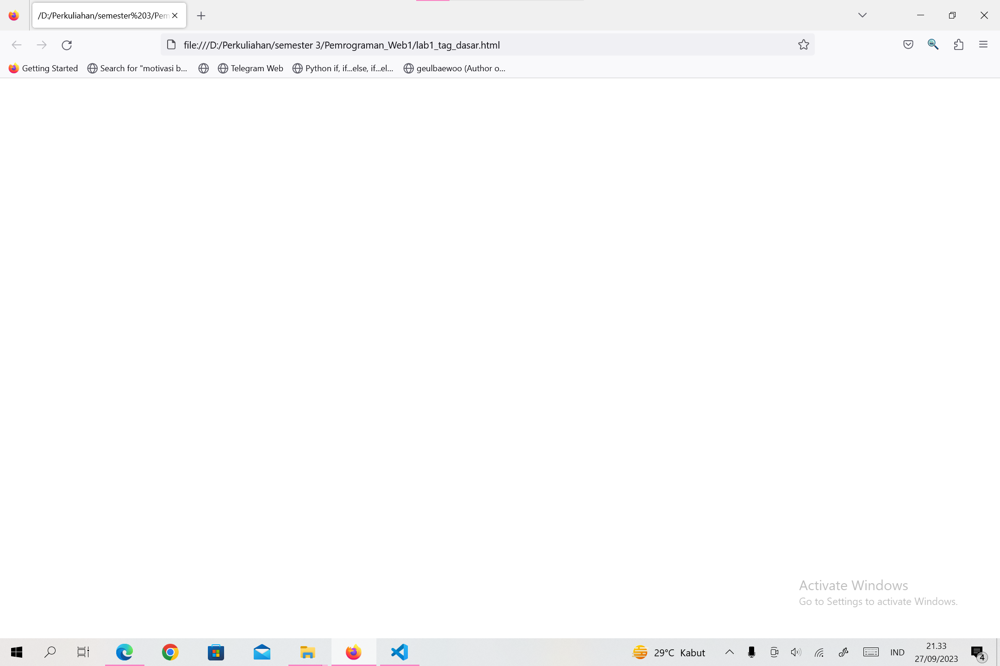 


### 1. Membuat Parafraf
Selanjutnya buatlah beberapa paragraf sederhana sebagai berikut
```html
<!-- Ini adalah paragraf pertama -->
<p>Kami sedang belajar HTML dasar, pada matakuliah Pemrograman Web di Prodi 
Teknik Informatika Universitas Pelita Bangsa. Pelajaran pertama yang kami dapat 
adalah membuat tampilan web sederhana dalam rangka mengenal tag-tag dasar 
HTML.</p>
<!-- Ini adalah paragraf kedua -->
<p>Ini merupakan sebuah paragraf yang terdiri dari beberapa kalimat yang saling 
mendukung sehingga menjadi satu kesatuan. Paragraf dibuat dengan menggunakan 
tag dasar html.</p>
```

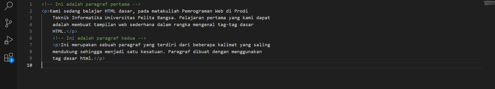 

Selanjutnya simpan kembali perubahannya, dan lakukan refresh pada web browser, lihat hasilnya.

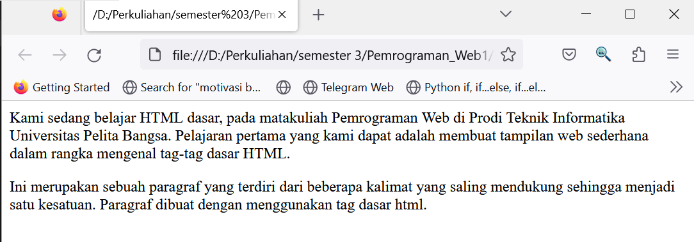 


Kemudian atur atribut paragraf seperti berikut, dan amati perubahanya.
```html
<!-- Ini adalah paragraf pertama -->
<p align=”center”>Kami sedang belajar HTML dasar, pada matakuliah Pemrograman 
Web di Prodi Teknik Informatika Universitas Pelita Bangsa. Pelajaran pertama 
yang kami dapat adalah membuat tampilan web sederhana dalam rangka mengenal 
tag-tag dasar HTML.</p>
<!-- Ini adalah paragraf kedua -->
<p align=”right”>Ini merupakan sebuah paragraf yang terdiri dari beberapa 
kalimat yang saling mendukung sehingga menjadi satu kesatuan. Paragraf dibuat 
dengan menggunakan tag dasar html.</p>
```

Simpan kembali dan amati perubahannya dengan melakukan refresh pada web browser. 
Selanjutnya silakan ubah-ubah nilai atributnya (align => justify, left, right, dan center) untuk melihat perbedaan lainnya. 

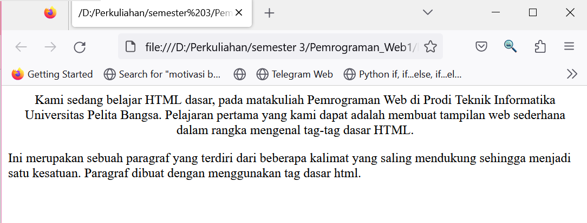


### 2. Menambahkan Judul
Seperti sudah dijelaskan pada materi bahwa judul memiliki 6 level yaitu mulai h1 sampai h6. 
Kemudian tambahkan judul h1 sebelum paragraf pertama dan tambahkan sub judul h2 sebelum paragraf kedua.

```html
<!-- judul paragraf pertama -->
<h1>Belajar Dasar HTML</h1>
<!-- judul paragraf kedua -->
<h2>Paragraf pada HTML</h2>
```

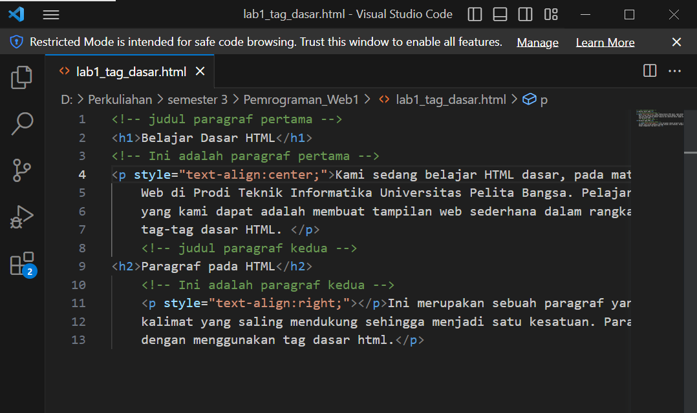


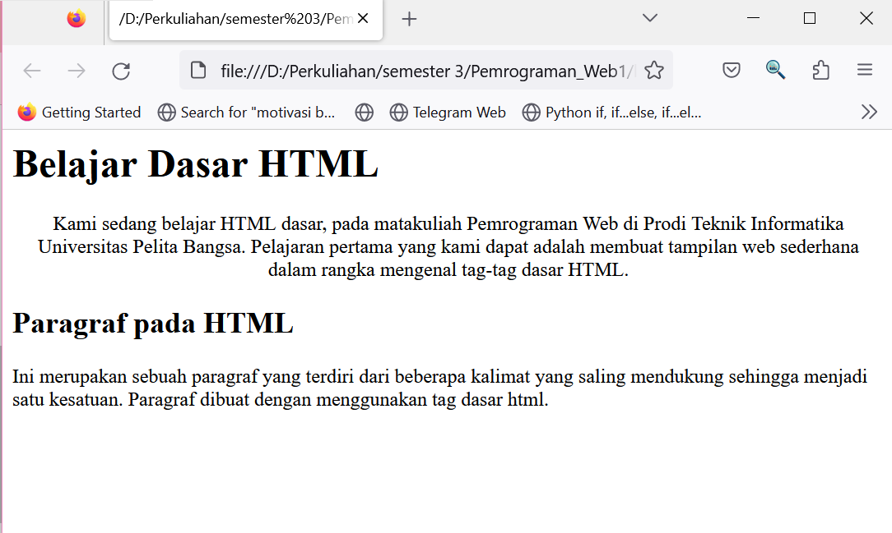


### 3. Memformat teks
1. _Teks Stabilo (Marker)_

kita bisa membuat sebuah marker atau penanda terhadap sebuah kalimat yang penting seakan-akan kita menggunakan stabilo.
Untuk melakukannya kita bisa menggunakan tag mark.

contoh :
```html
<h1>Penggunaan <mark>stabilo</mark></h1>

<p>
  Untuk hal-hal yang bersifat penting, kita bisa
  <mark>memanfaatkan fitur stabilo</mark>.
</p>
```

2. _Teks Tebal_

Untuk membuat teks menjadi cetak tebal kita bisa menggunakan dua buah tag:
Tag b
dan tag strong
Keduanya akan mengubah teks apa pun menjadi tercetak tebal.
contoh : 
```html
<p>
  Mencetak tebal sebuah teks <strong>sangat penting untuk
  memberikan</strong> tekanan atau penegasan pada suatu kalimat
</p>

<p>
  Tanpa teks yang tercetak tebal, sebuah paragraf akan
  <b>terlihat monoton</b> dan membosankan karena pembaca
  akan <strong>kesulitan</strong> menemukan intisarinya.
</p>
```

3. _Teks Miring_

Untuk membuat sebuah teks menjadi miring, kita bisa menggunakan tag baik tag i  atau tag em
Tag i untuk italic dan tag em untuk emphasis (penegasan).
contoh:
```html
<h1><i>Teks ini adalah teks italic biasa</i></h1>
<h1><em>Sedangkan teks ini memiliki makna penegasan</em></h1>
```

4. _Teks Garis Bawah_

Untuk melakukannya kita bisa menggunakan baik tag u yang bermakna underline, atau tag ins  yang bermakna insert.
contoh :
```html
<p>
  <ins>Pemformatan teks</ins> berikutnya yang bisa kita lakukan
  dengan HTML adalah <u>memberikan garis bawah</u> pada suatu kalimat.
</p>

<p>
  Untuk melakukannya kita bisa <u>menggunakan</u> baik tag &lt;u&gt;
  yang bermakna <i>underline</i>, <ins>atau</ins> tag &lt;ins&gt;
  yang bermakna <i>insert</i>.
</p>
```

5. _Teks Dicoret_

Caranya adalah menggunakan tag del yang bermakna delete.
contoh:
```html
<h1>Terkadang kita butuh untuk mencoret <s>sesuatu</s></h1>
<p>
  Aku sangat suka mencoret-coret <del>tembok rumah</del> di atas kertas.
</p>
```
6. _Teks Kecil_

Untuk melakukannya kita bisa menggunakan tag small.
contoh:
```html
<h2>Aku adalah <small>sebuah judul</small></h2>

<p>
  Ini adalah <small>contoh paragraf</small> di mana <br>
  ada beberapa <br>
  <small>teks yang</small> terlihat <br>
  lebih kecil <small>dari</small> ukuran normal.
</p>
```

7. _Teks Pangkat_

kita bisa membuat format teks pangkat dengan HTML. Baik pangkat atas mau pun pangkat bawah.

Untuk pangkat atas kita bisa menggunakan tag sup, sedangkan pangkat bawah bisa menggunakan tag sub.
contoh :
```html
<h2>satu pangkat <sup>dua</sup></h2>
<h2>satu pangkat <sub>tiga</sub></h2>

<hr>

<p>
  2<sup>3</sup> = 8
</p>

<p>
  Air = H<sub>2</sub>O
</p>
```

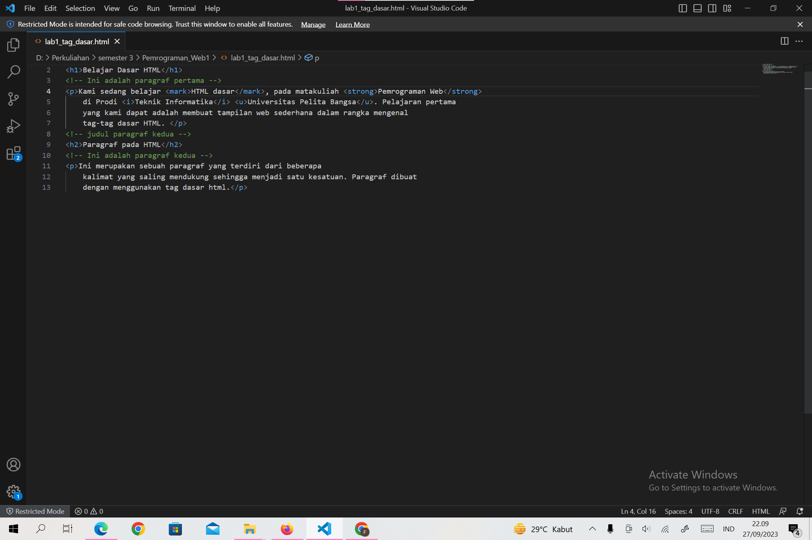


berikut hasilnya :

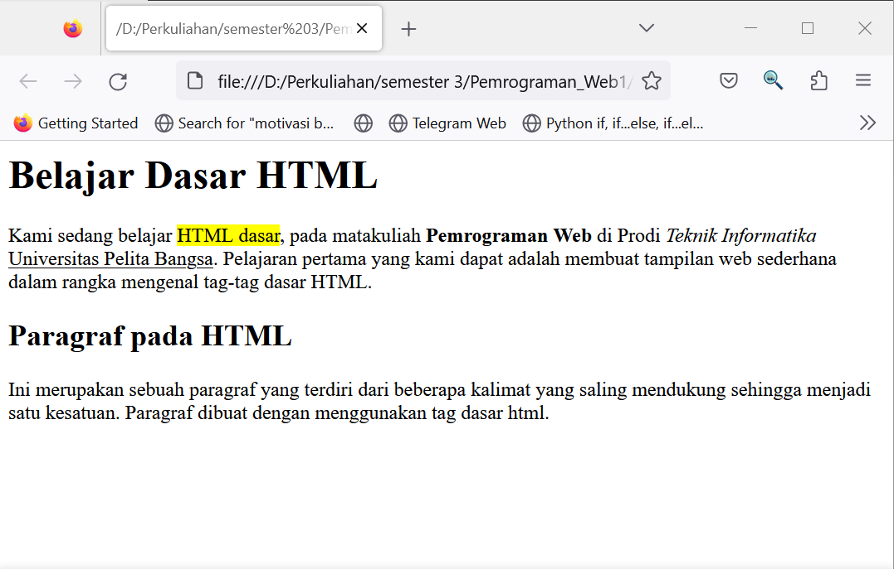


### 4. Menyisipkan Gambar
Untuk menyisipkan gmbar, siapkan gambar yang akan disisipkan pada halaman web, kemudian simpan file gambar tersebut satu folder dengan file dokumen html. Atau bisa juga menyisipkan gambar dari website external.


Kemudian tambahkan tag img setelah paragraf yang kedua, dengan menambahkan heading 3 sebelumnya.

```html
<!-- sub judul paragraf -->
<h3>Menambahkan Gambar</h3>
<!-- menambahkan gambar pada dokumen -->

```


Simpan perubahannya, kemudian refresh browser.


Gambar akan ditampilkan apa adanya sesuai dengan ukuran aslinya. Untuk mengatur ukuran gambar, dapat digunakan atribut witdh dan height dengan nilai integer yang disesuaikan.

```html
<!-- menambahkan gambar pada dokumen -->

```


hasilnya :


### 5. Menambahkan Hyperlink
Tambahkan hyperlink pada dokumen sebelum heading 1 seperti berikut.

```html
<!-- menambahkan link navigasi -->
<nav>
<a href="lab1_tag_dasar.html">Dasar HTML</a>
<a href="lab1_halaman2.html">Halaman 2</a>
<a href="http://www.google.com">Halaman Web Eksternal Google</a>
</nav>
<hr>

```


hasilnya :


Buat satu file lagi dengan nama lab1_halaman2.html kemudian isi dokumen tersebut dengan tag html dasar dan dengan isi bebas, boleh mengcopy dari halaman sebelumnya.


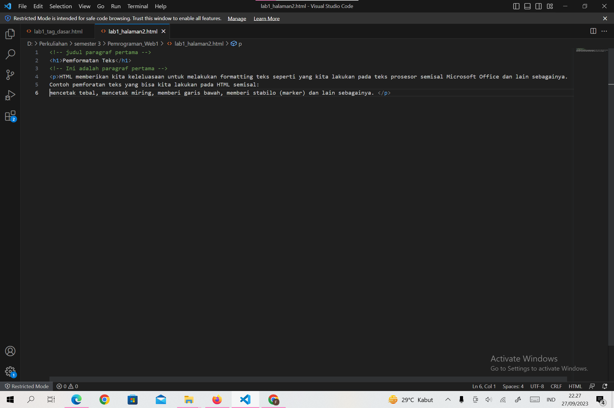


hasilnya saat di klik hyperlink di halaman1 muncul halaman2 yang telah dibuat.


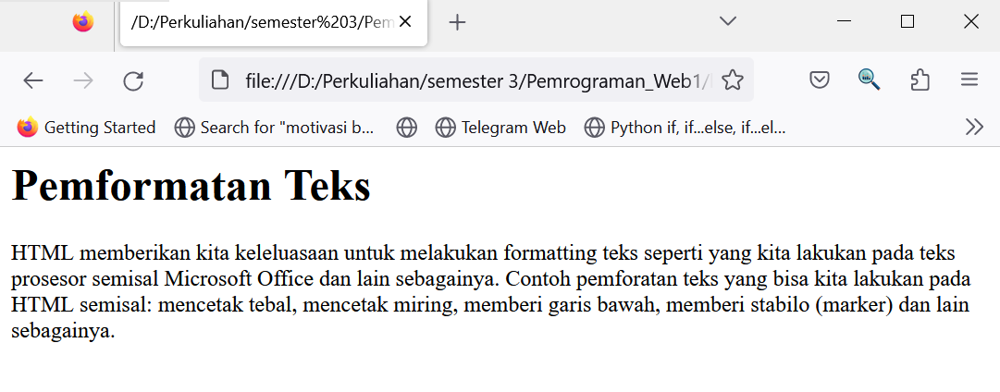


lalu jika di klik HalamanWebEksternalGoogle akan muncul seperti ini :


### JAWAB PERTANYAAN BERIKUT :

1. Lakukan perubahan pada kode sesuai dengan keinginan anda, amati perubahannya adakah 
error ketika terjadi kesalahan penulisan tag?

JAWAB :

Saya melakukan perubahan kode berikut :

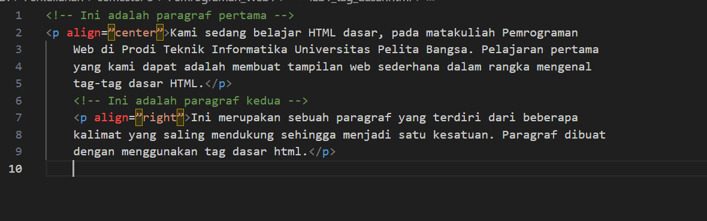


dapat dilihat tulisan aligin berwarna merah berarti eror.


kemudian setelah diperbaiki menjadi seperti ini :


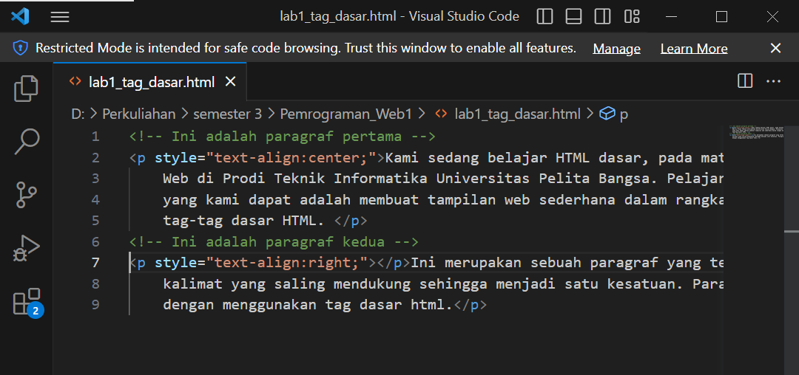


sekarang sudah tidak ada yang eror lagi :)

2. Apa perbedaan dari tag <p> dengan tag <br>, berikan penjelasannya!

JAWAB :

Tag <p>
Tag ini berfungsi untuk memberi perintah paragraf baru pada halaman html, antara baris atau paragraf terbentuk jarak.

Tag ini merupakan tag yang berpasangan, dimulai dengan tag pembuka <p> dan diakhiri dengan tag penutup </p>

Tag <br/>
Tag <br/>adalah tag tunggal tanpa diawali tag pembuka dan diakhiri tag penutup. Ia berdiri sendiri.

Tag <br/> dituliskan pada kerangka html untuk memberikan perintah "break line", artinya meng intruksikan baris baru.

Apa beda nya dengan tag paragraf .... ?, bedanya adalah baris baru yang dihasilkan tanpa memberi jarak dengan baris diatasnya.

Jadi perbedaan yang mencolok dari kedua tag ini adalah pada jarak yang terbentuk.
Kesimpulannya jika hanya ingin membuat baris baru tanpa jarak gunakan tag <br/> , tapi jika ingin membuat baris baru namun memiliki jarak dengan paragraf diatasnya maka bungkuslah paragraf baru tersebut dengan sepasang tag <p> dan </p>.

3. Apa perbedaan atribut title dan alt pada tag , berikan penjelasannya!

JAWAB :

Alt text atau text alternatif adalah atribut yang ditambahkan ke tag gambar dalam HTML. Teks ini muncul di dalam wadah gambar ketika gambar tidak dapat ditampilkan. Ini membantu mesin pencari memahami apa isi dari gambar tersebut. Text alternatif juga sangat membantu dalam kasus gambar yang tidak ditemukan pada halaman atau gambar rusak.
SEDANGKAN,
Title image adalah atribut lain yang dapat ditambahkan ke tag gambar dalam HTML. Title image ini digunakan untuk memberikan judul untuk gambar Anda. Text yang Anda masukkan di dalam tag judul tidak akan ditampilkan kepada pengguna ketika gambar tidak dapat ditampilkan. Sebaliknya, tag judul gambar ini ditampilkan saat Anda menyorot gambar dengan mouse.

4. Untuk mengatur ukuran gambar, digunakan atribut width dan height. Agar tampilan gambar proporsional sebaiknya kedua atribut tersebut diisi semua atau tidak? Berikan penjelasannya!

JAWAB :
menurut saya lebih baik satu attribut saja agar aspek ratio gambar asli terjaga.

5. Pada link tambahkan atribut target dengan nilai atribut bervariasi ( _blank, _self,_top, _parent ), apa yang terjadi pada masing-masing nilai antribut tersebut?

JAWAB :

Nilai _blank akan membuka link/halaman di tab baru.
Nilai _self akan membuka link/halaman di tab saat ini.
Nilai _top membuka link/halaman dan membatalkan semua frame.
Nilai _parent membuka link/halaman pada parent frame.